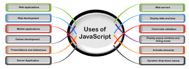

# Js

[

# JavaScript также используется во многих других областях.

##### 1 Web Applications Веб-приложения

##### 2 Web Development Веб-разработка

##### 3 Mobile Applications Мобильные приложения

##### 4 Game Игра

##### 5 Presentations Презентации

##### 6 Server Applications Серверные приложения

##### 7 Web Servers Веб-серверы

# РОЛЬ JAVASCRIPT В ВЕБ-РАЗРАБОТКЕ

[

> структурный презентационный поведенческий

# КРАТКАЯ ИСТОРИЯ JAVASCRIPT

> JavaScript был изобретен Бренданом Эйхом в 1995 году. Он был разработан для Netscape 2 и стал стандартом ECMA-262 в 1997 году. После того, как Netscape передал JavaScript ECMA, фонд Mozilla продолжил разработку JavaScript для браузера Firefox. Последняя версия Mozilla была 1.8.
> [
